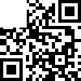
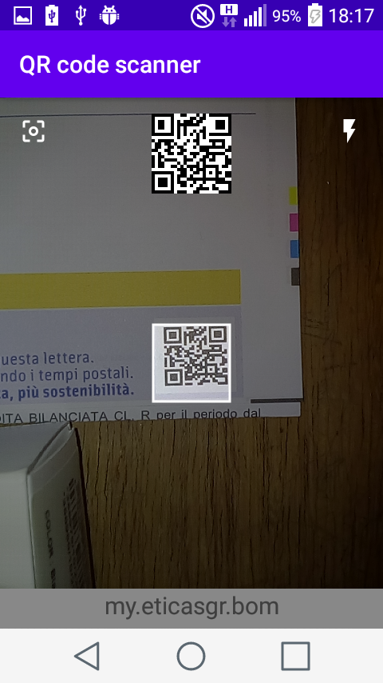

# QR code scanner
A simple Android application that decodes QR codes in the absence of one of the finder patterns.
15 neural networks are used to decode a maximum of 15 characters of the string encoded in the QR code.

Before run any python script install the python libraries indicated in list_of_required_python_lib.txt.

## Networks Architecture
each network is composed of:
1) 625 input neurons (input qr codes have 25x25 resolution)
2) a hidden layer with 128 neurons
3) 30 output neurons (1 neurons for each character that networks can predict)
4) a final layer that  find the output neuron with the highest value. The index of this neuron is inserted in the string "abcdefghijklmnopqrstuvwxyz./:#" to find the predicted character. The # is used when the string in the QR code is too short.

The training and validation dataset are generated using dataset_generator.py script; the test dataset is generated with the test_dataset_generator.py script.

The dataset images are similar to the following

## Android application
The base application is [code-scanner](https://github.com/yuriy-budiyev/code-scanner). This application has been modified to host neural networks for decoding.
The only activity of the project is the following

## Citations
Model: [YOLOv3](https://pjreddie.com/darknet/yolo/)

Similar app used to develop this application: [YOLOv3-CoreML](https://github.com/Ma-Dan/YOLOv3-CoreML)

## Useful Google Colab file

[From YOLOv3 to Custom Object Detection](https://colab.research.google.com/drive/1BNajhZAxU_8J8DoK43y2JEJog0l4Hb6X)

## Before Building the App
Download the [model](https://github.com/danielecolautti/LALakersAI/tree/main/zippedModel) and copy it into LALakersAI/Utils/

## Example Images

### Model Output

### Live Detection

### Statistics

### Line Up

### Successful Shot by Anthony Davis

### Settings

